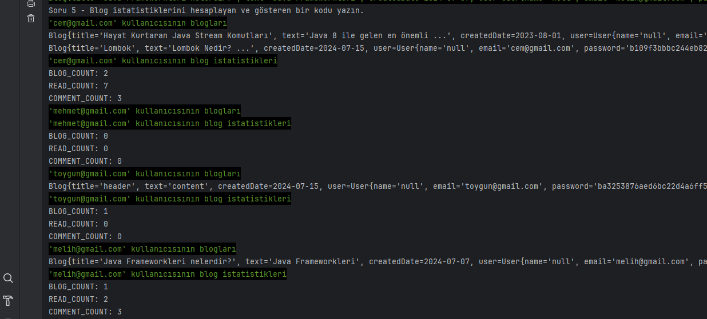
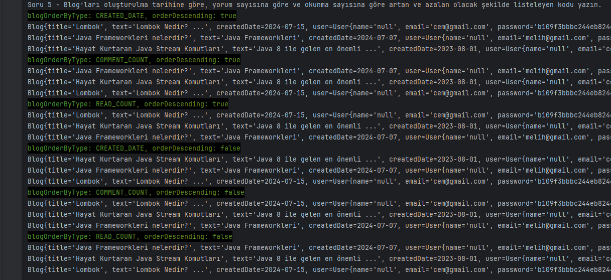

<!-- ABOUT THE PROJECT -->
## Project Description

### Question 5

BlogHub uygulamasına aşağıdaki özellikleri ekleyin. (30 PUAN)

- Password bilgisini SHA-512 ile hashleyin.
- Blog istatistiklerini hesaplayan ve gösteren bir kodu yazın.
- Blog’ları oluşturulma tarihine göre, yorum sayısına göre ve okunma sayısına göre artan
ve azalan olacak şekilde listeleyen kodu yazın

### Answer

- [Question5Main.java](../question5/main/java/Question5Main.java)

<!-- TECHNOLOGIES -->
### Technologies

### Output Screenshots

<!-- LICENSE -->
## License

Distributed under the MIT License. See `LICENSE.txt` for more information.

<!-- CONTACT -->
## Contact

### Melih Beşel

  

<!-- PROJECT-BOOTCAMP-PRACTICUM PART -->
 

## FT Teknoloji Java Spring Boot Bootcamp

  

    <h3 align="left">Company: FT Teknoloji</h3>
    
  

  

    <h3 align="left">Organizer: Patkia.dev</h3>
    
  

 
 
